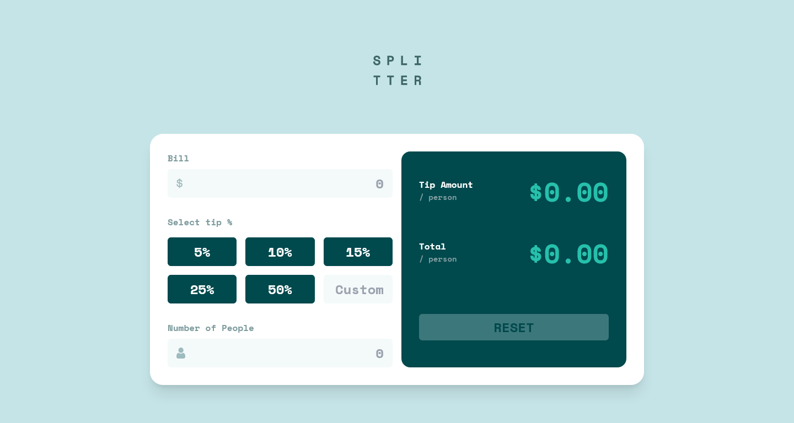
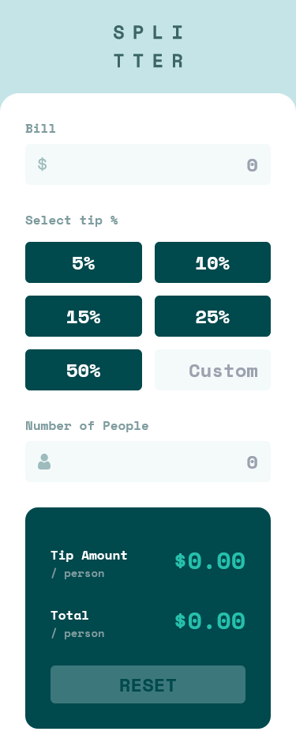

# Frontend Mentor - Tip calculator app solution

This is a solution to the [Tip calculator app challenge on Frontend Mentor](https://www.frontendmentor.io/challenges/tip-calculator-app-ugJNGbJUX). Frontend Mentor challenges help you improve your coding skills by building realistic projects.

## Table of contents

- [Overview](#overview)
  - [The challenge](#the-challenge)
  - [Screenshot](#screenshot)
  - [Links](#links)
- [My process](#my-process)
  - [Built with](#built-with)
  - [What I learned](#what-i-learned)
  - [Continued development](#continued-development)
- [Author](#author)

## Overview

### The challenge

Users should be able to:

- View the optimal layout for the app depending on their device's screen size
- See hover states for all interactive elements on the page
- Calculate the correct tip and total cost of the bill per person

### Screenshot

### Links

- Live Site URL: [Click here](https://tip-calculator-app-yaikarace.vercel.app)

## My process

### Built with

- Semantic HTML5 markup
- CSS custom properties
- Flexbox
- CSS Grid
- Mobile-first workflow
- [Tailwind CSS](https://tailwindcss.com/) - CSS Framework 
- [Vue JS](https://vuejs.org) - JS Framework

### What I learned
I learned how to use events in Vue js and how to make the calculator reactive so that when you type a number and select a tip, the result comes out without having to press any button.

### Continued development
I will keep learning more about Vue JS to keep improving in this amazing Framework.

## Author

- Frontend Mentor - [@YaikaRace](https://www.frontendmentor.io/profile/YaikaRace)
- GitHub - [YaikaRace](https://github.com/yaikarace)
- YouTube Channel - [Yaika Race](https://youtube.com/c/yaikarace)
